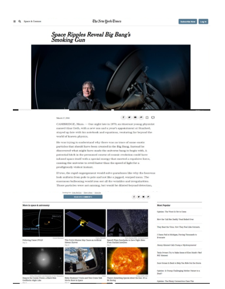

# New York Times Clone.

> This is a clone of tht New York Times page.

## Built With

- HTML5
- CSS3

## Live Demo

[Live Demo Link](https://rawcdn.githack.com/KelynPNjeri/New-York-Times-Clone/d76d09d29c8186d5322894942bd130157c380ab1/index.html)

## Getting Started

To get a local copy up and running follow these simple example steps.

### Prerequisites
- Git
- A browser

### Setup
To set up: 
1. You need to clone the repository.
2. Open the `index.html` file in your brower.

## Authors

👤 **Kelyn Paul Njeri**

- Github: [@KelynPNjeri](https://github.com/KelynPNjeri)
- Twitter: [@KelynNjeri](https://twitter.com/KelynNjeri)
- Linkedin: [Kelyn Njeri](https://linkedin.com/kelyn-paul)

👤 **Author2**

- Github: [@githubhandle](https://github.com/githubhandle)
- Twitter: [@twitterhandle](https://twitter.com/twitterhandle)
- Linkedin: [linkedin](https://linkedin.com/linkedinhandle)

## 🤝 Contributing

Contributions, issues and feature requests are welcome!

Feel free to check the [issues page](issues/).

## Show your support

Give a ⭐️ if you like this project!

## Acknowledgments

- Team Ocicats

## 📝 License

This project is does not use any license.